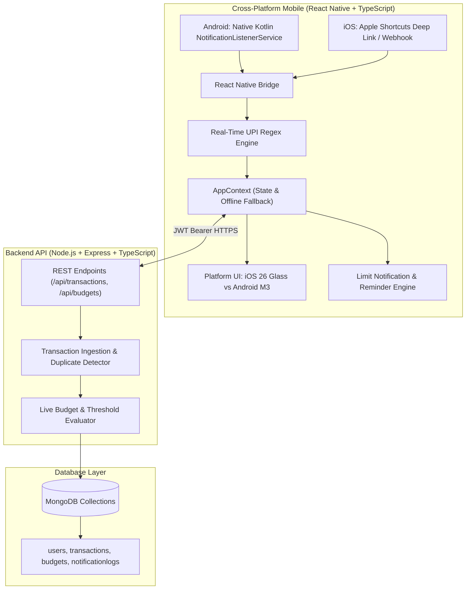

# 🚀 Production-Grade UPI Payment Tracker & Expense Monitor

A cross-platform financial application built with **React Native (TypeScript)** for Android & iOS and a high-performance **Node.js (TypeScript) + MongoDB** backend.

Designed with differentiated platform styling:
* **iOS**: **iOS 26 Liquid Frosted Glass** design system (translucent glassmorphism, Cupertino pill controls, SF-rounded typography, dynamic blur docks).
* **Android**: **Material 3 (Material You)** design system (elevated tonal containers, expressive pill chips, Material action buttons, dynamic accent colors).

---

## 🏗️ System Architecture



---

## ⚡ Key Production Features

### 1. UPI Payment Interception & Extraction
- **Android**: Custom Kotlin `NotificationListenerService` (`UpiNotificationListenerService.kt`) runs 24/7 in background to capture notifications from:
  - **Google Pay** (`com.google.android.apps.nbu.paisa.user`)
  - **PhonePe** (`com.phonepe.app`)
  - **Paytm** (`net.one97.paytm`)
  - **CRED** (`com.dreamplug.androidapp`)
  - **Amazon Pay** (`in.amazon.mShop.android.shopping`)
  - **BHIM** (`in.org.npci.upiapp`)
  - **Bank SMS** (HDFC, SBI, ICICI, Axis, Kotak)
- **iOS**: Apple Shortcuts Automation (`upitracker://log?text=...`) seamlessly triggers when SMS/notifications arrive.
- **Regex Extraction Engine**:
  - Automatically parses Amount (₹), Debits vs Credits, Merchant/Counterparty, VPA/UPI ID, and 12-digit UTR/Bank Reference numbers.
  - Auto-categorizes into *Food & Dining*, *Groceries*, *Travel & Cab*, *Shopping*, *Bills & Utilities*, *Entertainment*, *Health*, etc.

### 2. Spending Limits & Smart Reminders
- **Dual Limit Meters**: Set Daily (e.g. ₹2,000) and Monthly (e.g. ₹25,000) limits with real-time visual progress bars.
- **Dynamic Color Warnings**:
  - 🟢 **Healthy Spend** (< 80%)
  - 🟡 **Near Limit Warning** (80% – 99%, dispatches warning push notification & warning haptics)
  - 🔴 **Limit Exceeded** (100%+, dispatches alert push notification & error haptics)
- **Daily Spend Reminder Scheduler**:
  - Automatically schedules a local push notification at the user's preferred evening time (e.g., 8:30 PM) summarizing today's spend and remaining budget.

---

## 📂 Project Structure

```
/home/prasad/Documents/Mobile Apps/
├── backend/
│   ├── src/
│   │   ├── config/              # MongoDB connection (Mongoose)
│   │   ├── controllers/         # Auth, Transactions, Budgets, Analytics
│   │   ├── middlewares/         # JWT Bearer authentication
│   │   ├── models/              # User, Transaction, Budget, NotificationLog
│   │   ├── routes/              # Express API routers
│   │   ├── services/            # UPI Regex Parser & Budget Alert Engine
│   │   ├── test-parser.ts       # Standalone test bench for Indian UPI formats
│   │   └── server.ts            # Express server entry point
│   ├── .env.example
│   ├── package.json
│   └── tsconfig.json
│
├── mobile/                      # React Native + TypeScript (Expo compatible)
│   ├── android/                 # Native Android Kotlin module & Manifest
│   │   └── app/src/main/
│   │       ├── kotlin/com/upitracker/app/
│   │       │   ├── UpiNotificationListenerService.kt
│   │       │   └── UpiNotificationModule.kt
│   │       └── AndroidManifest.xml
│   ├── src/
│   │   ├── api/                 # Axios client with JWT interceptor & mock data
│   │   ├── components/
│   │   │   ├── android/         # M3SurfaceCard, M3Fab, M3FilterChip
│   │   │   ├── ios/             # IOSGlassCard, IOSSegmentedControl
│   │   │   └── common/          # LimitMeter, TransactionCard
│   │   ├── screens/
│   │   │   ├── DashboardScreen.tsx
│   │   │   ├── TransactionsScreen.tsx
│   │   │   ├── BudgetLimitScreen.tsx
│   │   │   ├── AnalyticsScreen.tsx
│   │   │   └── SetupTrackingScreen.tsx
│   │   ├── services/            # NotificationService, AndroidBridge, IosBridge
│   │   ├── store/               # AppContext state manager
│   │   └── theme/               # iOS 26 vs Android Material 3 palettes
│   ├── App.tsx                  # Root navigation & bottom dock
│   ├── package.json
│   └── tsconfig.json
└── README.md
```

---

## 🚀 Getting Started

### 1. Backend Setup
```bash
cd backend

# 1. Install dependencies
npm install

# 2. Run regex parser test suite (verifies GPay, PhonePe, Paytm, SMS parsing)
npm run test:parser

# 3. Start development server
npm run dev
```
The backend will run on `http://localhost:5000`. Health check at `http://localhost:5000/api/health`.

### 2. Mobile App Setup (React Native)
```bash
cd mobile

# 1. Install mobile dependencies
npm install

# 2. Start Expo / React Native bundler
npm start

# To run directly on Android:
npm run android

# To run directly on iOS Simulator:
npm run ios
```

---

## 🔔 Testing Limits & Reminders Instantly
1. Open the app and navigate to the **Limits (🎯)** tab.
2. Under **"Test Notifications & Haptics"**, tap:
   - **Test 80% Warning**: Triggers immediate threshold notification.
   - **Test Exceeded Alert**: Triggers immediate limit crossed error notification.
   - **Test Daily Summary**: Triggers daily spend summary reminder.
3. On the **Overview (📊)** tab, tap **"Simulate Intercepted UPI"** to watch transactions log and progress meters adjust in real time!
